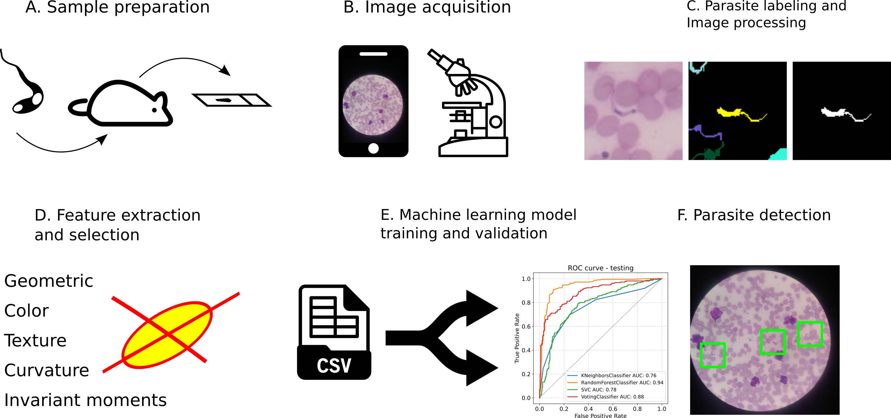

# Introduction

Chagas detection is a tool for the detection of _T. cruzi_ trypomastigote forms in blood smear images. In particular, it provides a machine learning based method for the detection of parasites in images acquired using a mobile phone camera. This repository contains the codes for _T. cruzi_ detection. The images for training and testing the model are available at [Zenodo](https://doi.org/10.5281/zenodo.5123062).

[](https://doi.org/10.5281/zenodo.5123062)


[](https://www.gnu.org/licenses/gpl-3.0.en.html)

<!---
To refer to this particular tool or image dataset in a publication, please cite:

> **ADD CITATION HERE!.**
--->

## Functionality



This repo contains the following functionality:

1. `my_tools.py` contains auxiliary, and image data processing functions.
2. `process_image.py` runs the image processing, feature extraction and classification on a single image.
3. `process_all_images.py` runs the image processing and feature extraction on all images.
4. `features_classification.py` trains and assess model performance based one extracted features.
5. `images_info.csv` contains image metadata
	+ _filename_: the image file name.
	+ _width_: image width in pixels.
	+ _height_: image height in pixels.
	+ _n_structures_: number of labeled parasite structures.
	+ _resize_factor_: scale factor to reduce image.
	+ _set_: image used for model training or testing.

6. `positions_data.csv` contains the position of each parasite object (nucleus or kinetoplast) in the respective image.
	+ _filename_: the image file name.
	+ _x, y_: the structure position (x, y) in the image.
	+ _structure_: the name of the annotated structure.
	+ _set_: image used for model training or testing.
	+ _new_x, new_y_: the structure position (x, y) in the image after resizing.

7. `features_data.csv` contains the extracted feature values from each image.
	+ _filename_: the image file name.
	+ _parasite_ID_: the number of the parasite in the image.
	+ _label_: the parasite segment number
	+ _centroid_x, centroid_y_: the position (x, y) of the parasite in given 100 x 100 pixel^2^ area.
	+ _area : curvature_energy_: geometric, color texture and invariant moment features of the parasites.
	+ _structure_: presence (`True`) or absence (`False`) of the parasite in the segmented region.

8. `images/` and `models/` folders contains the sample test image and the trained models, respectively.
9. `object_selection_knn.py` Script to select samples for the training/test dataset 

**NOTE:** This tool is a command-line Python script, without graphical user interface (GUI) at the moment. Since these analysis steps are often performed in different datasets, all the provided functions should be fast to implement and automate. It is not intended for diagnosis, but for research purpose only.

## Installation

The simplest way to install this tool is to clone this repository and create an Anaconda (or mini-conda) environment with the [required](./requirements.txt) libraries. An Anaconda install guide is available [here](https://docs.anaconda.com/anaconda/install/). To clone this repository open a terminal window and type:

```
git clone https://github.com/csbl-br/chagas_detection.git
```

## Usage


Save the image at `./images/` folder and run `process_image.py` to analyze single file.


```
$ python3 process_image.py
```

Run `process_all_images.py` to extract features from all images, followed by `feature_classification.py` to train a model.

***
### License
These codes are free software; you can redistribute it and/or modify it under the terms of the GNU General Public License as published by the Free Software Foundation (GNU General Public License v3.0). It is distributed in the hope that it will be useful, but WITHOUT ANY WARRANTY and LIABILITY; without even the implied warranty of fitness for a particular purpose, including diagnostic. See the [GNU General Public License](./LICENSE) for more details.
